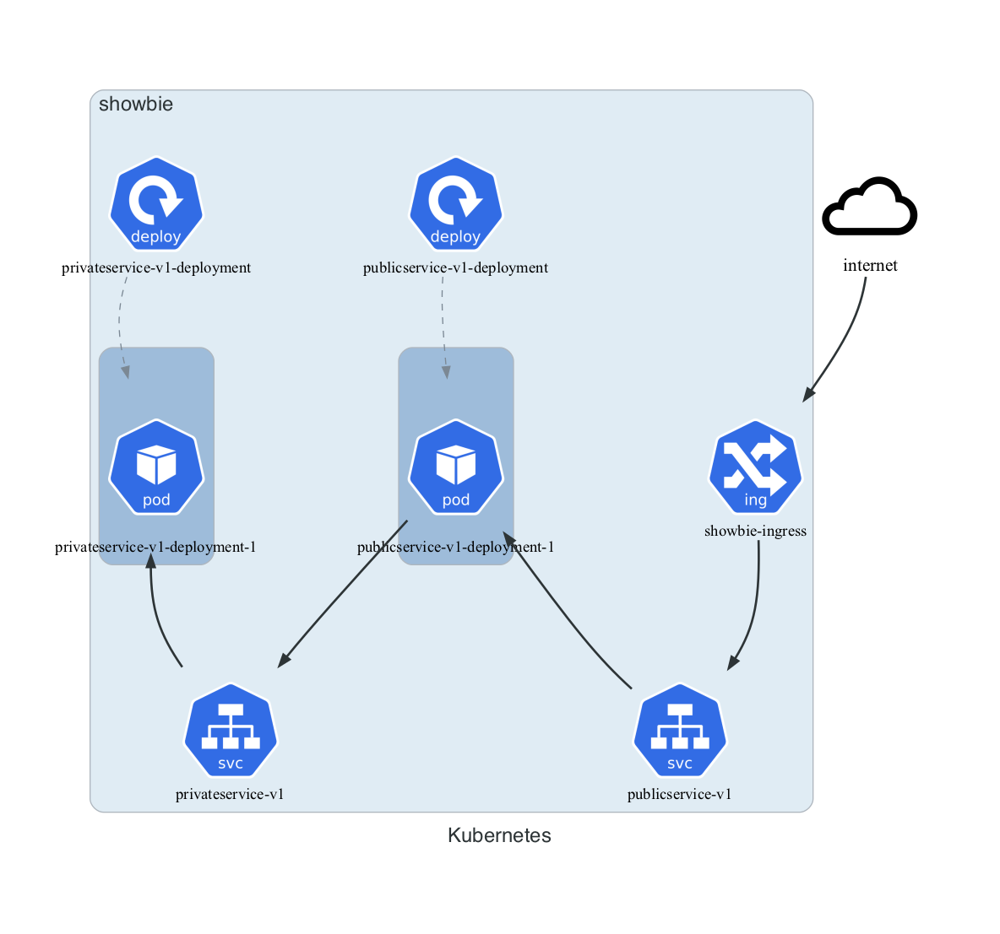

# Introduction

This is the Kubernetes Cluster Micro-Service Task. The template project README can be found at [docs/README.md](docs/README.md).


# Architecture

This project provides a Kubernetes Cluster Micro-Service Task consisting of two services running in a Kubernetes cluster.



**publicservice** and **privateservice** both of which serve up random messages:

- **publicservice** requests can be made via `http://<host>:8081/message`
- **privateservice** requests can be made via `http://<host>:8082/message`

Users can ask the **publicservice** for a public or private message, if a private message is requested then **publicservice** requests a message from the **privateservice**. Users cannot access **privateservice** directly.


Requests to **publicservice** must be accompanied by an authorization bearer JWS token, signed with the expected HS256 signing key. The token must contain valid `iat`, `exp`, and `scopes` claims, where scope must be one or more of the following: `PUBLIC_SERVICE`, `PRIVATE_SERVICE`. If the request contains `PUBLIC_SERVICE` scope then **publicservice** returns a public random message; if the request contains `PRIVATE_SERVICE` scope then **publicservice** returns a private random message obtained from the **privateservice**.

In the Kubernetes deployment above, the **privateservice** is only reachable from within the cluster; to ensure that only **publicservice** can access it, requests to **privateservice** must also be accompanied by a similar JWS token signed with a key only these two services know about. Additionally, the only token `scope` supported is `PRIVATE_SERVICE`. This ensures that *only* **publicservice** can make requests of **privateservice**.


A sample positive **publicservice** response messages is:

```json
[
  {
    "origin": "public",
    "text": "Someone will invite you to a Karaoke party."
  },
  {
    "origin": "private",
    "text": "Your reality check about to bounce."
  }
]
```

Where the `origin` value indicates which service the message originated from.

In the event that a request's JWS token cannot be verified or it contains insufficient or incorrect claims then the request will be denied returning a `401 Unauthorized` error response. In the event that the request cannot be fulfilled then a `404 NotFound` or  `500 InternalServiceError` response is returned. In all error cases, the response body is similar to:

```json
{
  "timestamp": "2021-11-20T19:53:50.945+00:00",
  "status": 401,
  "error": "Unauthorized",
  "message": "Authentication is required, please include a valid token"
}
```

Where the attributes are specific to the error type.


# Service Configuration

Both services use the Spring framework and two Spring profiles are
provided for each of the services and the integration tests allowing
different configuration in different environments. Profile `local`
is used by default and `prod` is used when running inside Kubernetes.
The configuration includes common HS256 signing keys (one shared
between **publicservice** and **privateservice** and the other
shared between **publicservice** and the integration tests).

The profile-specific configuration files are located at
- private-service/src/main/resources/application-local.properties
- public-service/src/main/resources/application-local.properties
- tests/integration/src/main/resources/application-local.properties

and 
- private-service/src/main/resources/application-prod.properties
- public-service/src/main/resources/application-prod.properties
- tests/integration/src/main/resources/application-prod.properties

# Build Instructions

The project includes four Java projects:

- __common__ -- Library containing common code used by the services.
- __private-service__ -- Spring-based micro-service for the **privateservice**, listens on port 8081.
- __public-service__ -- Spring-based micro-service for the **publicservice**, listens on port 8082.
- __tests/integration__ -- Spring-based integration tests used to validate the behavior of the services when deployed together.

This project uses [Gradle Wrapper with multi-project builds](https://docs.gradle.org/6.8.1/userguide/intro_multi_project_builds.html) and can be built via

```sh
./gradlew clean build
```

This will build all four projects and run any included tests.


# Testing

Multiple levels of testing is provided (and there is some overlap):

1. Unit tests for classes providing non-trivial business
   logic.  These are intended to focus on algorithmic correctness,
   logical conditional paths, and exception handling.
2. Functional tests for services proving feature-level correctness
   and overall behavior in the application setting (ie. correct use of
   frameworks). Note that external entities are mocked out. Note also,
   that functional tests give a good opportunity to verify logging
   across multiple scenarios.
3. Integration tests for verifying functionality in an
   _as close to production as possible_ environment. These are used to
   prove out the service configuration and plumbing between services.

Unit and functional tests are run as part of the build process. Integration tests may be run must be manually run after a deployment (see next section) or may be run against locally running services via:

```sh
./gradlew tests:integration:integration
```

by default the integration tests make requests to http://localhost:8081/message using the token key defined in the integration test's local profile properties file (matching the token key used by the public-service's local profile).


# Deployment Instructions

### Environment

My environment is running macOS 12.0.1 running:

- Docker Desktop v4.2.0
- minukube v1.24.0 with the following builtin addons enabled:
  - ingress
- kubernetes-cli v1.22.3


### Steps

#### 1. Build Services and Docker Images

Build the services' Docker images via

```sh
./gradlew clean build docker
```

this will ensure a clean build and also run any unit and functional tests.


#### 2. Push Docker Images

Manually push the Docker images to DockerHub (can use DockerDesktop), currently using my `farrenlayton` image name and registry; these can be changed by editing the image names in

- public-service/build.gradle
- private-service/build.gradle
- deployment.yaml


#### 3. Deploy

Deploy the services using kubectl:

```sh
kubectl apply -f deployment.yaml
```

This creates the pods and services in the usual `showbie` namespace. At this point, the pods should run but neither are accessible from outside the cluster.

You can confirm these were created via `kubectl get all --namespace showbie` and it should return something similar to:

```sh
NAME                                                READY   STATUS    RESTARTS   AGE
pod/privateservice-v1-deployment-6dddccf44c-t9wkb   1/1     Running   0          4m17s
pod/publicservice-v1-deployment-5cff8b9794-tdjtw    1/1     Running   0          4m17s

NAME                        TYPE       CLUSTER-IP       EXTERNAL-IP   PORT(S)          AGE
service/privateservice-v1   NodePort   10.102.244.182   <none>        8082:31495/TCP   4m17s
service/publicservice-v1    NodePort   10.96.107.232    <none>        8081:31844/TCP   4m17s

NAME                                           READY   UP-TO-DATE   AVAILABLE   AGE
deployment.apps/privateservice-v1-deployment   1/1     1            1           4m17s
deployment.apps/publicservice-v1-deployment    1/1     1            1           4m17s

NAME                                                      DESIRED   CURRENT   READY   AGE
replicaset.apps/privateservice-v1-deployment-6dddccf44c   1         1         1       4m17s
replicaset.apps/publicservice-v1-deployment-5cff8b9794    1         1         1       4m17s
```


#### 4. Expose Public-Service via Ingress

There are multiple ways to expose the **publicservice** publicly using **minikube** but we want a general solution that works in **minikube** and in a remote cloud.

Here we are utilizing **minikube**'s builtin addon **ingress**, we assume this has been previously enabled.

Configure the ingress for **publicservice** via:

```sh
kubectl apply -f ingress.yaml
```

This will create an ingress rule allowing public-service to be accessed via http://<externalIP>/publicservice/v1/<resource>

Note that **minikube** requires its tunnel to be running to enable network access to the cluster:

```sh
minikube tunnel
```

This command must be left running for the duration of the deployment and integration tests.

The ingress can be confirmed via `kubectl get ing --namespace showbie` and it should return something like:

```sh
NAME              CLASS   HOSTS   ADDRESS     PORTS   AGE
showbie-ingress   nginx   *       localhost   80      10m
```


#### 5. Verify Services

Before running the integration tests it is important to wait for both **publicservice** and **privateservice** to start, as they can take some time. We do this by reading their log files.

```sh
kubectl logs -f --all-containers -l app=publicservice-v1 --namespace=showbie
```

This will follow the log messages as they are emitted; wait until you see the "Started Application in X.XXX seconds" message.

Repeat with the **privateservice**:

```sh
kubectl logs -f --all-containers -l app=privateservice-v1 --namespace=showbie
```


#### 6. Run the Integration Tests

When the services are running in a Kubernetes environment we must supply the Spring profile which includes configuration compatible with the services as well as the IP address where the **publicservice** can be reached. The following command will provide both and run the integration tests:

```sh
spring_profiles_active=prod request_host=localhost/publicservice/v1 ./gradlew clean tests:integration:integration
```

The `spring_profiles_active` variable is required for the integration tests to use the same HS256 token signing key as the deployed **publicservice**.


# Questions

### 1. What ways can you have visibility into the services?

There are multiple ways to view you services, but it depends on what
information you are looking for. In particular, here are the tools I
commonly use from high-level to low-level access:

Kubernetes tools can be used to view all deployed assets and metadata
about the services:

- The CLI command `kubectl get all --namespace=showbie`.  This is not
  usually used in production.

- The kubernetes dashboard (may be provided by the cloud provider)
  provides a graphical webpage containing equivalent information
  usually with additional information (like service resource usage)
  and links to lower-level access (like logs and metrics).

The ways of determining if a service is behaving correctly are:

- By issuing common API requests to the running service using a tool
  like Postman.

- Watching the service log files as it runs and responds to
  requests.  This is the most common method I use with production
  services.

- Some cloud providers collect various runtime metrics that can be
  viewed over time (ie.  on a dashboard), this is a good way of
  verifying multiple services at a high level.

- There are tools allowing the service code itself to generate similar
  metrics.

- Some cloud providers provide alerting on those metrics or on
  availability of the service (by making requests to a known API
  point); these are often used to inform support or developers
  immediately when some condition is reached (ie. service outage or
  metrics exceed some limit).

Lastly, these services are running in containers thus you should
be able to:

- Gain SSH access directly into the container to view or edit files
  and configuration.
- Similarly, use a remote debugger to attach to the running service to
  debug problems live. This is rarely used in production, but one can
  always run the same container locally with similar configuration and
  use the remote debugger there.


### 2. How can you ensure the services are behaving as expected?

First off, I use automated testing to verify behavior before the
services are put into production:

1. Unit tests for classes providing non-trivial business logic. These
   are intended to focus on algorithmic correctness, logical conditional
   paths, and exception handling.

2. Functional tests for services proving feature-level correctness and
   overall behavior in the application setting (ie. correct use of
   frameworks). Note that external entities are mocked out.  Note also,
   that functional tests give a good opportunity to verify logging across
   multiple scenarios.

3. Integration tests for verifying functionality in an
   _as close to production as possible_ environment. These are used to
   prove out the service configuration and plumbing between services.

These tests can/should be run both locally by the developer and during
any automated build and release cycles prior to deployment.

Secondly, during deployment I verify that Kubernetes has successfully
deployed the service and verify the service logging during it's
startup procedure.

Thirdly, post-deployment, the behaviors are confirmed using a manual
smoke-test by issuing API requests to the service(s) using a tool like
Postman.

Fourthly, the service log file is again verified by looking for
evidence of my manual smoke-test and/or other requests.

In a production cloud environment, I've also set up custom dashboards
to view pertinent metrics over time (does today's metrics look like
yesterday's?) and make use of alerting when critical metrics exhibit
unexpected values (is some abnormal behavior happening now?).


### 3. If we require our services to scale, what modification would you make to support horizontal scaling

In general there are a few prerequisites to horizontal scaling:

- the service should be small in scope

- the service must be stateless

- the service should minimize it's external runtime dependencies

- the service must be running behind a load-balancer

For this assignment, the services are already small in scope and
stateless, so all we really require is a load-balancer for each service so that both can be accessed via a single URI.

However, because the public-service calls the private-service, both
services must be scaled in unison so that a public-service request is
not waiting too long for a response from the private-service. Because
not all user calls to public-service require an internal call to
private-service the services need not scale to the exact same number
of instances; since the percentage of private service calls is <=100%
and dependent on the user scopes, it may be better to configure the
services to auto-scale the number of instances based on a resource
metric (ie.  CPU, number of requests, or private-service response
times).


# Comments

1. I added more logging than needed for observability into the services'
   behavior, including correlation ids (for tracking a single request
   through multiple services) and authentication failure reasons. These
   would normally be downgraded to debug or trace levels (or removed
   completely) but are handy for debugging during development and testing.

2. I left some TODO's in the code because they are "nice-to-haves" but
   addressing them could be considered "gold-plating" and unnecessary for
   the assignment.

3. The HS256 encryption algorithm is a symmetric algorithm meaning
   that a single secret is used to both encrypt and decrypt.  This is
   simpler for assignment purposes, but I strongly recommend using an
   asymmetric algorithm using a public and private key pair allowing the
   public key to be used for token creation and the private key used for
   token verification. Authentication secrets should be protected, and we
   should minimize the number of actors with access to those secrets.

4. Currently, the HS256 signing keys are stored in the services and
   integration test's application properties files. This is a bad idea
   because they are stored in plaintext. A best practice is to not store
   production secrets in source code and instead store them directly in
   Kubernetes as [Kubernetes Secrets](https://kubernetes.io/docs/concepts/configuration/secret/)
   where they can be exposed only to the services that require them.
   However, I left them in the application properties for this assignment
   as the HS256 symmetric key must be also known to the integration tests
   (using an algorithm using a private/public key pair would resolve this).

5. The **privateservice** can only be called from **publicservice** as
   requested, this was implemented using a combination of schemes:
   - Kubernetes does not expose **privateservice** publicly, the service is fully accessible from _any_ pods running in the cluster.
   - **privateservice** requires the same HS256-based JWS tokens but with a signing key known _only_ to it and **publicservice**. Thus, any other service running in the cluster would also need to sign its tokens with the same key before **privateservice** would respond to its requests.

7. I quite liked this assignment. Despite having experience with Java
   Spring and Kubernetes, it was a good exercise to implement a custom
   security mechanism and get a local Kubernetes cluster up and
   running. Both of these I have been curious about but
   neither have been priorities in my current work position.

Thanks for the learning opportunity!


